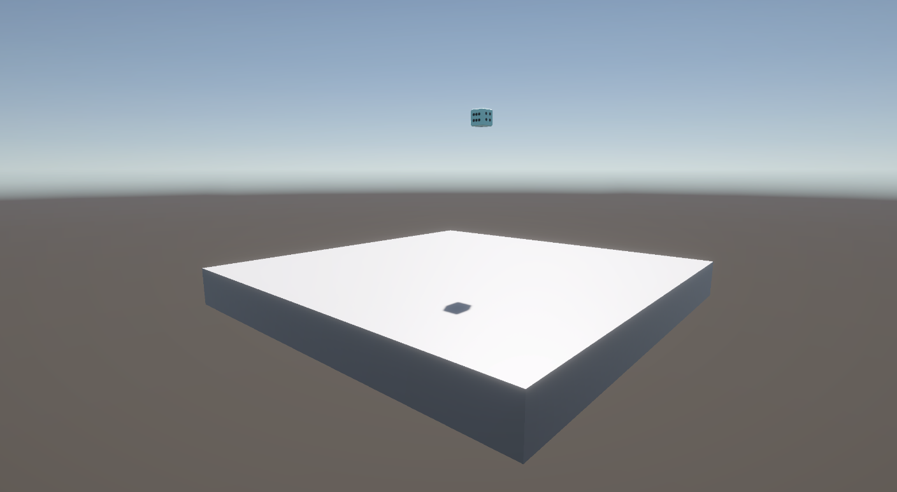
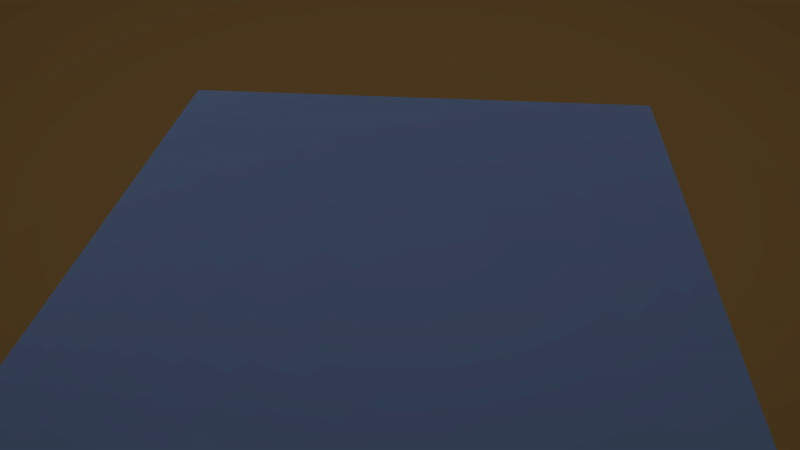
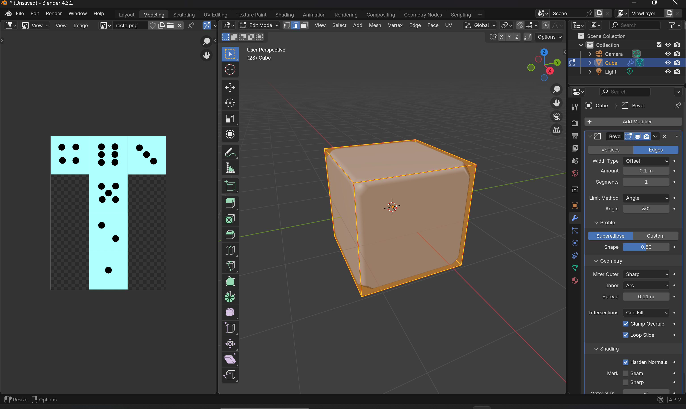
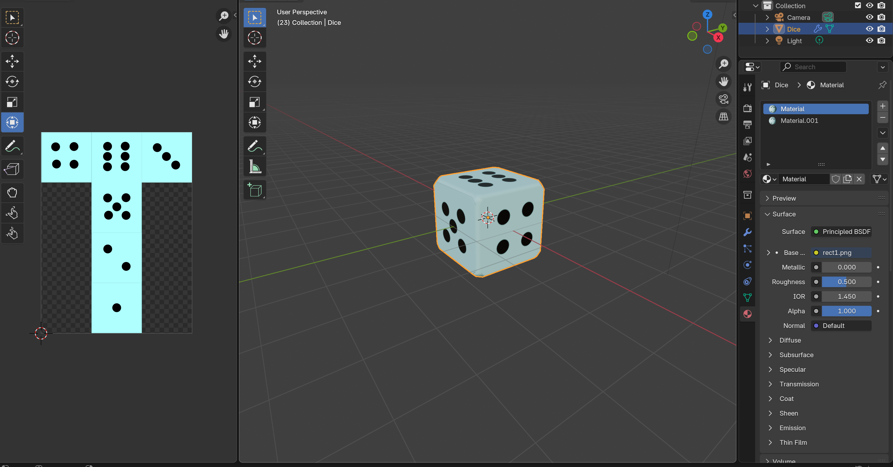
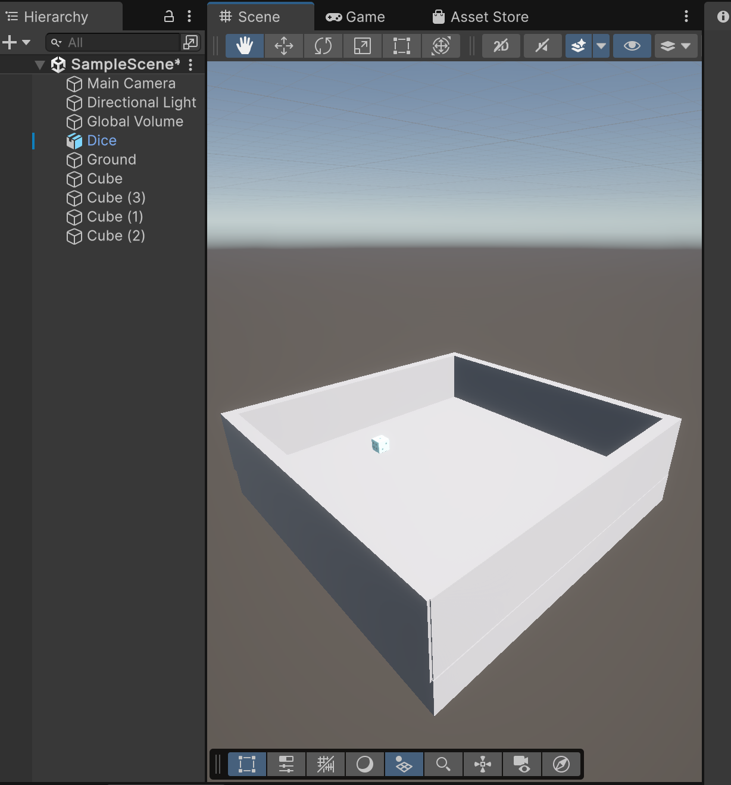
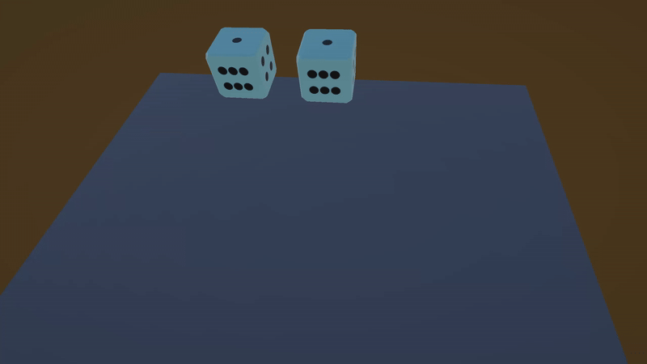

# Day 3 - 3D Dice Simulation 🎲

This project is a **3D dice rolling simulation** built in Unity using C#. The goal is to provide a realistic physics-based dice roll with accurate face detection upon landing.

## ✨ Features
- **Realistic physics-based dice rolling** 🎲
- **Automatic face detection** - The game identifies the top face of the dice when it stops rolling.
- **Multiple dice support** - Roll more than one die at the same time!
- **Uses Unity's Rigidbody and Colliders** for realistic physics.
- **Custom dice model** created in Blender.

## 🚀 How It Works
1. Press `Space` to roll the dice.
2. The dice will fall, bounce, and come to a stop.
3. Once the dice stop moving, the script detects the top-facing number.
4. If the detection fails (e.g., dice land on an edge), the dice will re-roll.

## 🛠️ Technologies Used
- **Unity Engine** (Physics and Rendering)
- **C#** (Game logic, physics control)
- **Blender** (3D modeling and mesh optimization)
- **Inkscape** (for texture design)

## 🛠 How I Built It  

### 1️⃣ Creating the Dice Model  
- Opened **Blender** and designed a simple dice cube.  
- Rounded the edges for a more realistic effect.
  
  
  
- Used **Inkscape** to create the texture (baby blue background with black dots).  
- Applied the texture in Blender, making sure each face mapped correctly.
  
  
  
- Exported the model as `.fbx` for Unity.  

### 2️⃣ Setting Up in Unity  
- Imported the `.fbx` model into Unity.  
- Created a **ground plane** and added **invisible walls** to prevent the dice from rolling off.
- Added **Mesh Collider** and **Rigidbody** to enable realistic physics.

  

### 3️⃣ Implementing Dice Face Detection  
- Placed **six invisible sphere colliders** on each face of the dice.  
- These colliders **detect which side lands face down**, determining the rolled value.  

### 4️⃣ Writing the Code  
- **`Dice.cs`** (Handles rolling, physics, and detecting the final result).  
- **`DiceSide.cs`** (Detects which side is touching the ground).  

### 5️⃣ Debugging & Fixing Issues  
- Faced an issue where the dice kept spinning indefinitely.  
- Realized the **ground object had no tag**, preventing collision detection!  
- Fixed it by setting the **"Ground" tag**, ensuring face detection worked properly.  

## 📚 References & Credits
- 🎥 [Tutorial On How To Create Simple 3D Dice Model In Blender And Export It To Unity Project As FBX File](https://www.youtube.com/watch?v=GuzHCeEB-rM)
- 🎥 [Unity 5 Tutorial: Physical Dice](https://www.youtube.com/watch?v=i4-EAZpJwV4)
