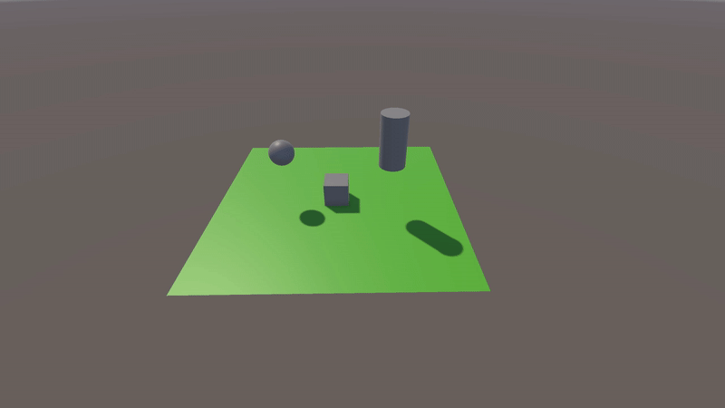
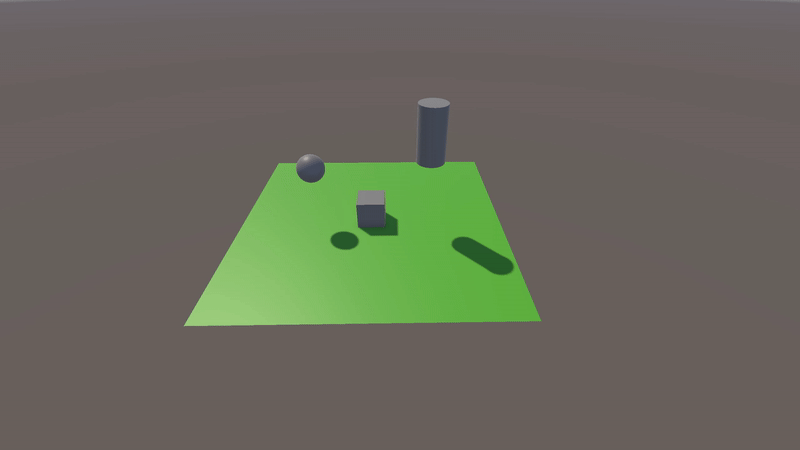

# 🎯 Day 4 - Unity Introduction: Scenes, GameObjects, Components, Transform

## 1. Scenes in Unity
A **scene** in Unity is an environment where all game objects exist. Each game has at least one scene, but it can have many (for example, the main menu or different levels).

### How to create a scene
- **File > New Scene**
- To navigate in the scene:  
  - Camera rotation: `Alt + Left Click`  
  - Zoom in/out: `Scroll mouse`  
  - Move: `Middle mouse click`

## 2. GameObjects
A **GameObject** is any object in a Unity scene (cubes, spheres, characters, lights, cameras).  
GameObjects can be organized in hierarchies (parent-child relationship).

## 3. Components
A **component** is a behavior or property attached to a GameObject.  
For example:  
- **Rigidbody** – Adds physics to an object.  
- **Collider** – Allows detecting collisions.

### How to add a component
- Select a GameObject from **Hierarchy**.
- Go to **Inspector** -> **Add Component**.

## 4. Transform
Each GameObject in Unity has the **Transform Component** (in the Inspector window), which determines:
- **Position**: Where the object is in the scene.
- **Rotation**: Which direction the object is oriented.
- **Scale**: How big or small the object is.

### Position (Press W)
Position of a GameObject is defined through X, Y, Z coordonates.

```csharp
transform.position = new Vector3(0, 2, 0);
```



### Rotation (Press E)
Rotation controls the direction in which the object is oriented. Unity uses Euler Angles (degrees) and Quaternions to set the rotation.

- How to set the rotation
```csharp
void Start()
{
  transform.rotation = Quaternion.Euler(0, 90, 0);
}
```
- How to set continuous rotation
 ```csharp
void Update()
{
  transform.Rotate(0, 50 * Time.deltaTime, 0);
}
```


### Scale (Press R)

- How to set the scale
```csharp
void Start()
{
  transform.localScale = new Vector3(2, 2, 2);
}
```
- How to gradually decrease the scale over time
 ```csharp
void Update()
{
  transform.localScale -= new Vector3(0.01f, 0.01f, 0.01f);
}
```



## 5. Movement, Rotation, and Scaling Script

To enhance our Unity project, we implemented a **C# script** that allows a GameObject to move, rotate, and scale dynamically based on keyboard input.

### 🔹 Features
✅ **Movement** – Control the object using `W, A, S, D`.  
✅ **Rotation** – Rotate left/right with `Q` and `E`.  
✅ **Scaling** – Increase or decrease size using `Z` and `X`.

### 🛠 How It Works
The script reads player input using **Input.inputString** and applies transformations based on the key pressed. 

- **Movement**: Uses `transform.Translate()` to move in the respective direction.
- **Rotation**: Uses `transform.Rotate()` to adjust orientation.
- **Scaling**: Modifies `transform.localScale` to change object size dynamically.
