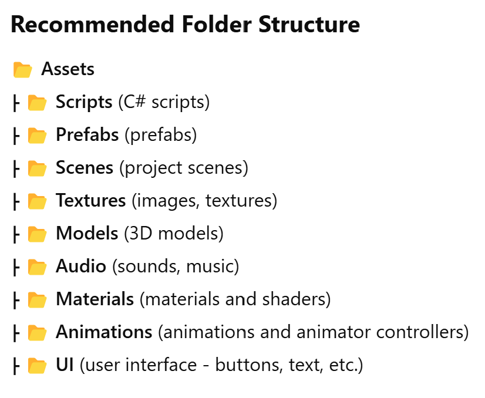
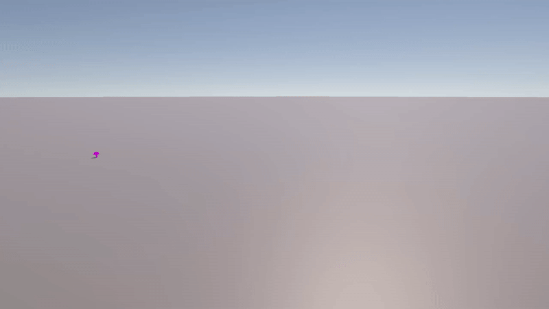

# 🎯 Day 5 - Prefabs, Randomized Spawning, and Scene Organization in Unity

## 1. Importing Assets
**Assets** are all the resources used in a Unity project, such as 3D models, images, sounds, scripts, materials, and more.

### How to Import Assets in Unity?
- **Using the Unity Asset Store:**  
  `Window -> Asset Store` (for older versions) or `Window -> Package Manager` (for newer versions).  
  Download the asset and click **Import**.
- **Using Drag & Drop:**  
  Open **File Explorer** (Windows) or **Finder** (Mac) and drag the files directly into the **Assets** folder in Unity.
- **Using the Import Menu:**  
  Go to `Assets -> Import New Asset` and select the file you want to import.
- **Importing a Unity Package (`.unitypackage`):**  
  `Assets -> Import Package -> Custom Package...`  
  Select the `.unitypackage` file and click **Import**.

---

## 2. Prefabs
A **Prefab** is a reusable, predefined object that can be instantiated multiple times in a scene.

### How to Create a Prefab?
1. Create an object in the scene.
2. Drag the object from the **Hierarchy** into the **Assets** folder.
3. Unity will automatically create a `.prefab` file.
4. You can now instantiate this Prefab multiple times in your scene.

### How to Edit a Prefab?
1. Double-click the **Prefab** in the **Assets** folder.
2. A separate **Prefab Editing Mode** will open.
3. Any modifications made to the Prefab will automatically update all instances of it in the scene.

---

## 3. Organization of the Project in Unity


---

## 4. Introduction to C#

### Classes in C#
A **class** is a blueprint for creating objects. In Unity, each script is a class that usually **inherits** from `MonoBehaviour`, which allows it to be attached to GameObjects.

### Methods in C#
A **method** is a function defined inside a class that can be called to execute specific code.

Types of methods:
- **Void methods** (do not return a value)
- **Methods that return a value** (`int`, `string`, etc.)
- **Methods with parameters**

### Inheritance in C#
**Inheritance** is a mechanism where a class can inherit the characteristics of another class.

#### **Syntax:**
```csharp
public class Dog : Animal
```
Here, Dog inherits from Animal, meaning it will have access to Animal's properties and methods.


## 5. Mushroom Spawner Project



### **Description**
This project focuses on **using prefabs and scripting to spawn mushrooms at random positions** in a 3D scene. The spawner automatically instantiates a mushroom prefab at set intervals, demonstrating **instantiation, randomization, and project organization** in Unity.

### **Features**
- **Mushroom Prefab** that gets spawned dynamically in the scene.
- **Randomized spawn locations** to create variation in placement.
- **Automatic spawning** at a fixed interval.
- **Scene organization best practices**, following structured asset management.

### **Project Setup**
1. **Create a new Unity project** (3D template).
2. **Import or create a mushroom model** and convert it into a **Prefab** (`Assets -> Prefabs`).
3. **Create an Empty GameObject** and rename it to `MushroomSpawner`.
4. **Attach the Spawner script** to the `MushroomSpawner` GameObject.
5. **Assign the Mushroom Prefab** to the script’s `mushroomPrefab` field in the **Inspector**.

### **How to Run**
1. Click the **Play** button in Unity.
2. The Spawner will instantiate a **new mushroom every few seconds** at a **random position**.
