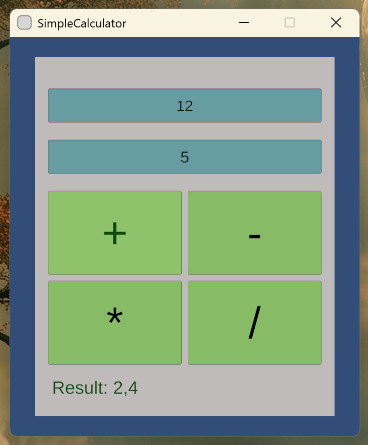

# 🎯 Day 2 - Simple Calculator (Unity)

## **📌 About the Project**
This project is part of my **365 Days of Code** challenge.  
For Day 2, I created a **simple calculator** using **Unity** and **C#** with a user interface (UI).  

It performs **basic arithmetic operations**:  
✔ **Addition (`+`)**  
✔ **Subtraction (`-`)**  
✔ **Multiplication (`*`)**  
✔ **Division (`/`)**  

---

## **📌 Preview**
Here’s how the calculator looks in action:  



---

## **📌 Features**
- 🖥️ **Graphical User Interface (GUI)** using **Unity UI**  
- 🖩 Handles **addition, subtraction, multiplication, and division**  
- 📝 Displays **live results** on screen  
- 🎨 Styled UI with **color-coded buttons and structured layout**  

---

## **📌 Technologies Used**
- **Unity** (UI system, event handling)  
- **C#** (for logic and calculations)  
- **TextMeshPro** (for better text rendering)  

---

## **📌 How to Run the Project**
### **1️⃣ Clone the repository**
```sh
git clone https://github.com/SabeCiupi/365-days.git
cd 365-days/day2
```
